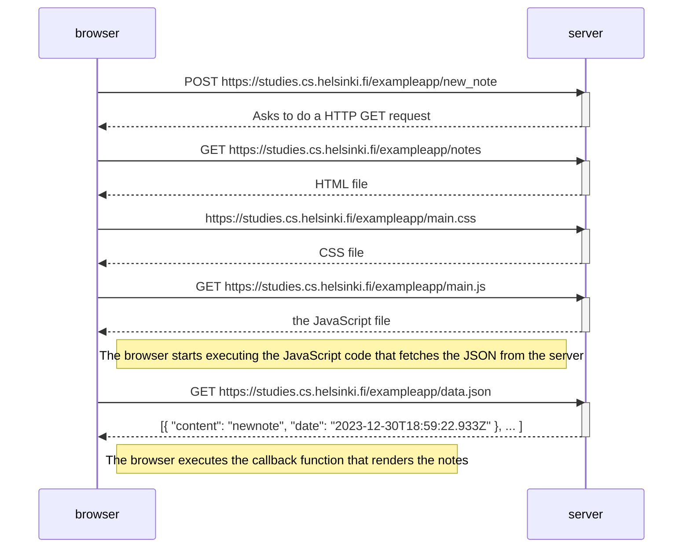
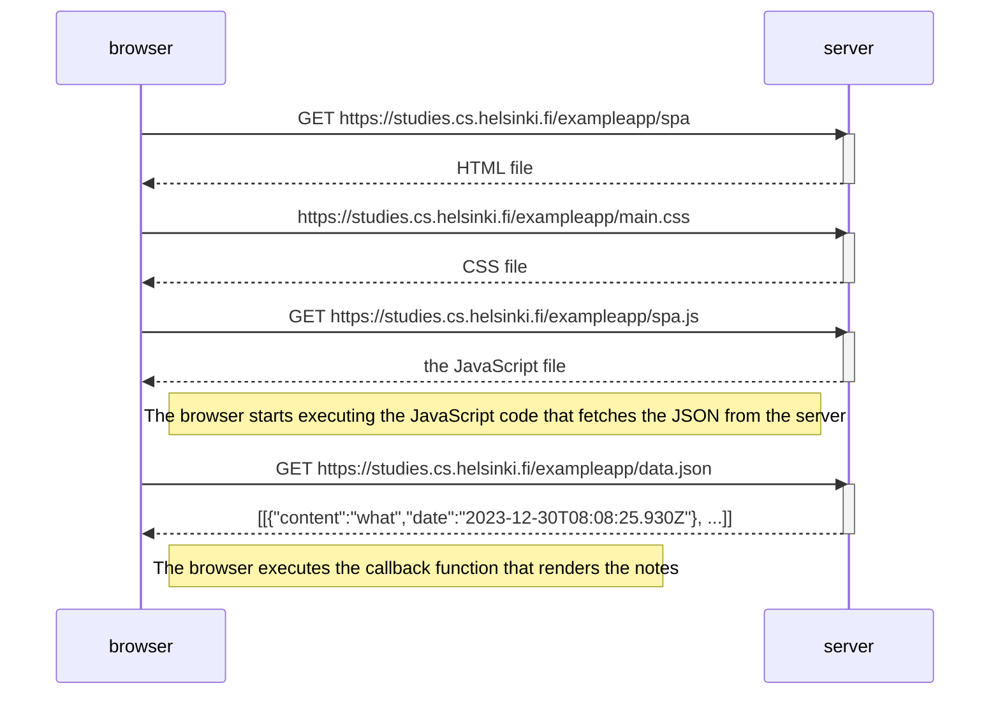
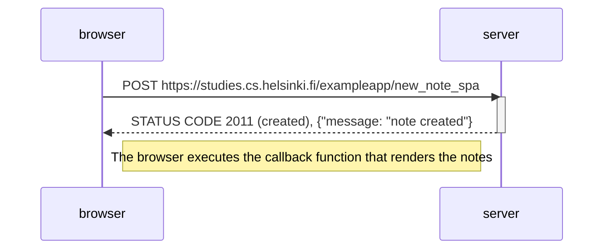

# Sequence diagram exercises:

Each folder contain one of the sequence diagram that i made to represent simple POST and GET requests as a exercise. For simplicity, you can see all three of them below:

## Sequence diagram of the network requests between browser and server after making a POST request

## Sequence diagram of the network requests between browser and server after accessing a SPA (Single-page application) version of the same site of the first exercise:

## Sequence diagram of the network requests between browser and server after making a POST request at a SPA (Single-page application) version of the same site of the first exercise:

